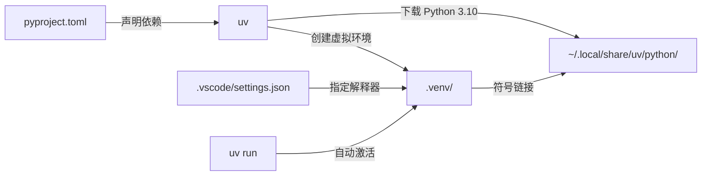
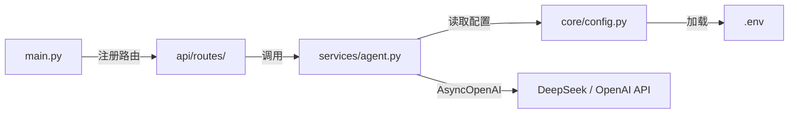

# lm-agent

AI Agent 后端服务，基于 FastAPI + OpenAI SDK 构建，支持多模型对话、流式响应，预留 LangChain/CrewAI 等 Agent 框架扩展接口。

## 环境

- Python >= 3.10（uv 管理）
- 依赖见 `pyproject.toml`

### uv 工作流



| 层 | 说明 |
|----|------|
| `uv` | Python 包管理器（替代 pip + venv），负责下载 Python 本体 + 创建 `.venv` + 安装依赖 |
| `pyproject.toml` | 声明项目依赖，`uv sync` 会把 `api`、`core`、`models`、`services` 安装为可导入包 |
| `.python-version` | 声明项目需要 Python 3.10，uv 自动识别 |
| `.venv/bin/python` | 符号链接 → uv 管理的 CPython 3.10 |
| `uv.lock` | 锁定精确依赖版本 |
| `.vscode/settings.json` | 告诉 VS Code 使用 `.venv/bin/python` 运行/调试代码 |

## 项目架构



- `core/config.py`：`pydantic-settings` 自动读取 `.env`，类型安全
- `services/agent.py`：`AgentService` 封装异步 LLM 调用，全局单例
- `api/routes/`：FastAPI 路由，`chat.py` + `health.py`
- `main.py`：应用入口，挂载 CORS 和路由前缀 `/api/v1`

## 快速开始

```bash
uv sync
uv run uvicorn main:app --reload
```

访问 `http://127.0.0.1:8000/docs` 查看 Swagger 自动文档。

## 目录

| 文件/目录 | 作用 |
|-----------|------|
| `main.py` | FastAPI 应用入口，注册路由和中间件 |
| `api/routes/` | 路由层 —— `chat.py`（对话）、`health.py`（健康检查） |
| `services/agent.py` | Agent 服务层，封装 LLM 调用 |
| `core/config.py` | `pydantic-settings` 配置，自动加载 `.env` |
| `models/schemas.py` | Pydantic 请求/响应模型 |
| `pyproject.toml` | 项目元数据与依赖声明 |
| `.env` | 环境变量（API Key 等） |
| `.vscode/` | VS Code 配置（解释器路径） |
| `.venv/` | uv 管理的虚拟环境 |

## API 端点

| 方法 | 路径 | 说明 |
|------|------|------|
| `GET` | `/api/v1/health` | 健康检查 → `{"status":"ok"}` |
| `POST` | `/api/v1/chat` | 同步对话，请求体 `{"message":"...","model":"deepseek-chat"}` |
| `GET` | `/docs` | Swagger 自动文档 |

## 环境变量

在 `.env` 中设置：

- `OPENAI_BASE_URL` / `OPENAI_API_KEY` — OpenAI 兼容接口
- `DEEPSEEK_BASE_URL` / `DEEPSEEK_API_KEY` — DeepSeek 接口

## Agent 扩展

`services/agent.py` 当前基于 `AsyncOpenAI` 直调。后续可按层替换：

| 层 | 当前 | 可替换为 |
|----|------|---------|
| Agent 引擎 | `AsyncOpenAI` | LangChain `AgentExecutor` / CrewAI |
| 工具调用 | 无 | Function Calling / MCP |
| 记忆 | 无 | LangChain Memory / 外部向量库 |
| 流式 | 预留 async generator | SSE `StreamingResponse` |
